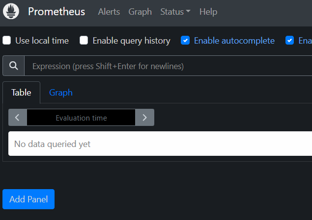

## Установка и настройка сервера мониторинга
**Мониторинг серверов**: Grafana, Prometheus и Node Exporter.

**Grafana** - это платформа для визуализации и мониторинга данных. Она предоставляет возможность создавать гибкие и интерактивные дэшборды, интегрировать различные источники данных и отслеживать метрики производительности в реальном времени.

**Prometheus** спроектирована для сбора, агрегации и визуализации разнообразных данных о состоянии приложений и инфраструктуры. Она использует модель HTTP/Metrics для сбора данных и обладает встроенной поддержкой для мониторинга контейнеризованных приложений.

**Node Exporter** - это инструмент, разработанный для экспорта системных метрик с узлов (например, серверов) для мониторинга. Он предоставляет доступ к различным метрикам, таким как использование ЦП, загрузка системы, использование памяти, сетевой трафик и другие характеристики производительности, что позволяет отслеживать состояние и работу узлов в реальном времени.

Для начала подготовим нашу директорию, куда будем скачивать все архивы:

```bash
mkdir elk && cd elk
```
### Node Exporter
Первым делом устанавливаем Node Exporter. Скачайте архив по следующей ссылке: [Node Exporter wget](https://github.com/prometheus/node_exporter/releases/download/v1.7.0/node_exporter-1.7.0.linux-amd64.tar.gz)


Выполните следующие команды для скачивания и разархивирования:
```bash
wget https://github.com/prometheus/node_exporter/releases/download/v1.7.0/node_exporter-1.7.0.linux-amd64.tar.gz
```


При помощи команды `tar -xvf` архив разархивируется в текущую директорию, а затем удален архив.
```bash
tar -xvf node_exporter-1.7.0.linux-amd64.tar.gz && rm node_exporter-1.7.0.linux-amd64.tar.gz
```

Переходим в директорию `node_exporter-1.7.0.linux-amd64`:
```bash
cd node_exporter-1.7.0.linux-amd64
```

Пробуем запустить **Node Exporter**:

```bash
./node_exporter
```

:::note
Если все выполнено правильно, то при доступе к `ip_address:9100` в браузере вы должны увидеть страницу с версией и метриками.
:::


Теперь мы копируем наш **Node Exporter** в `/usr/local/bin`:

```bash
sudo cp node_exporter /usr/local/bin
```


Далее необходимо создать `systemd` службу для работы **Node Exporter** в фоновом режиме и чтобы она автоматически включалась после перезапуска сервера.

Создайте нового пользователя с ограниченными привилегиями для безопасности выполнением следующей команды:

```bash
sudo useradd --no-create-home --shell /usr/sbin/nologin node_exporter
```

Проверьте, что пользователь был создан:

```bash
id node_exporter
```
Должен быть выведен идентификатор пользователя (uid).


Задайте владельца `/usr/local/bin/node_exporter` для нового пользователя:
```bash
sudo chown -R node_exporter:node_exporter /usr/local/bin/node_exporter
```

Теперь создайте службу `systemd` для **Node Exporter**:
```bash
sudo nano /etc/systemd/system/node_exporter.service
```

Вставьте следующий код в открытый файл:
```bash
[Unit]
Description=NodeExporter

[Service]
TimeoutStartSec=0
User=node_exporter
ExecStart=/usr/local/bin/node_exporter --web.listen-address=:9100

[Install]
WantedBy=multi-user.target
```


Перезагрузите демон systemd и запустите созданную службу `node_exporter.service`:

```bash
sudo systemctl daemon-reload
sudo systemctl start node_exporter.service
```

Проверьте статус службы и удостоверьтесь, что она запустилась без ошибок:

```bash
sudo systemctl status node_exporter.service
```
Вывод без ошибок должен иметь такой вид:


Теперь **Node Exporter** будет запускаться автоматически при перезагрузке сервера. Чтобы добавить его в автозагрузку, выполните следующую команду:

```bash
sudo systemctl enable node_exporter.service
```

Теперь у вас полностью готовый Node Exporter, развернутый на вашем сервере. Вы можете получить доступ к метрикам по адресу :9100/metrics.


<br>
</br>
<br>
</br>
<br>
</br>
<br>
</br>


### Prometheus
Далее приступаем к установке `Prometheus`.
:::note
В этой статье я использовал последнюю версию 2.48 на момент написания.
:::
Переходим в официальный GitHub-репозиторий Prometheus:
[Prometheus](https://github.com/prometheus/prometheus), читаем документацию и приступаем к скачиванию и установке.

**Прямая ссылка wget:** [Prometheus wget](https://github.com/prometheus/prometheus/releases/download/v2.48.0/prometheus-2.48.0.linux-amd64.tar.gz)

После скачивания вытаскиваем из архива
```bash
tar xvfz prometheus-*.tar.gz
cd prometheus-*
```

Переносим нашу директорию в `/usr/local/bin`
```bash
sudo mv prometheus-2.48.0.linux-amd64/ /usr/local/bin/prometheus
```

Так же создаем отдельно юзера для **Prometheus**
```bash
sudo useradd -M -U prometheus
```

Назначаем владельца директории:
```bash
sudo chown prometheus:prometheus -R /usr/local/bin/prometheus
```

Нужно настроить **Prometheus** на сбор метрик из двух сервисов, `себя` и `node_exporter`
В директории есть файл `prometheus.yml` в него мы добавляем наши строчки:
:::note
Замените IP на ваш.
:::
```yaml
    static_configs:
      - targets: ['192.168.0.36:9090', 192.168.0.36:9100']
```
Создаем systemd сервис в `/etc/systemd/system/prometheus.service` для автозапуска.
```bash
[Unit]
Description=Prometheus Service
After=network-online.target

[Service]
User=prometheus
Group=prometheus
Restart=on-failure
ExecStart=/usr/local/bin/prometheus/prometheus \
  --config.file=/usr/local/bin/prometheus/prometheus.yml \
  --storage.tsdb.path=/usr/local/bin/prometheus/data \
  --storage.tsdb.retention.time=30d

[Install]
WantedBy=multi-user.target
```
:::danger
Не забываем сделать релоад systemd.
:::

```bash
sudo systemctl daemon-reload
sudo systemctl start prometheus.service
```

Добавляем в автозагрузку:
```bash
sudo systemctl enable prometheus.service
```

Ребутаем сервер
```bash
sudo reboot
```

После ребута проверяем все ли правильно запустилось
```bash
sudo systemctl status node_exporter.service
sudo systemctl status prometheus.service
```

Если все запустилось без ошибок, то в браузере переходим по нашему ip:port
**http://192.168.0.36:9090** и наблюдаем наш рабочий `Prometheus`



### Grafana
Ну вот наконец мы дошли с Вами и до `Grafana`. Работа **Grafana** заключается в том, чтобы подключиться к `Prometheus` и визуализировать собранные метрики.

Официальный репозиторий `Grafana`: [Ссылка](https://github.com/grafana/grafana)
В этой статье я использовал версию `OSS 10.2.2`

Скачиваем **.deb** пакет и распакововаем его, но перед этим установим зависимости которые требуются для **Grafana**:
```bash
sudo apt-get install -y adduser libfontconfig1 musl
wget https://dl.grafana.com/oss/release/grafana_10.2.2_amd64.deb
sudo dpkg -i grafana_10.2.2_amd64.deb
```
После установки пакета делаем `sudo systemctl daemon-reload` и `sudo systemctl enable grafana-server.service` и проверим статус `sudo systemctl status grafana-server.service`
Если все получилось, то вывод будет таким:


:::tip
Теперь все готово к настройке и работе. Настройку и объяснения к дашборду я объясню в следующей статье.
:::

Переходим по нашему айпи и порту 3000:  **192.168.0.36:3000**

:::tip
Заходим в веб-панель по стандартному логину паролю `admin:admin`
:::
